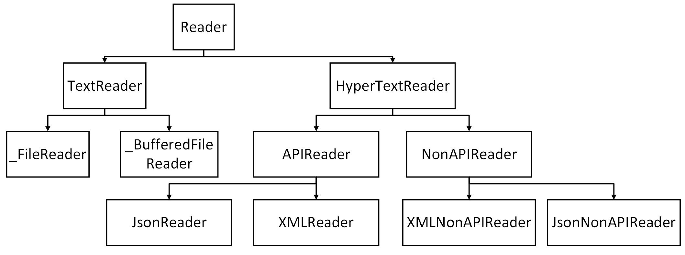
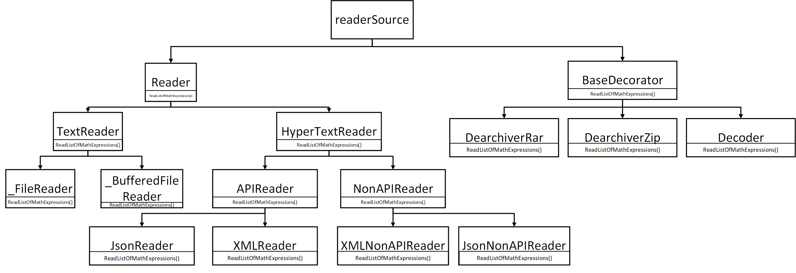

# Math calculator problem in Java

## Contents:
- [Problem statement](#Problem-statement)
- [List of subtasks](#List-of-subtasks)
- [Brief description of the solution](#Brief-description-of-the-solution)
- [Few words about structure](#Few-words-about-structure)
- [Few words about patterns](#Few-words-about-patterns)

---

## Problem statement
It is needed to implement a console application that:
1) Reads data from an input file.
2) Processes the received information.
3) Writes the data to an output file.

The input and output files can be in the following formats: txt, xml, json. Additionally, the input and output files can be archived (zip, rar) and encrypted in various sequences (only archived, only encrypted, first archived then encrypted, and vice versa).

The task is to find all arithmetic operations in the input file and replace them with the results in the output file. Calculations should be performed in three ways:
- Regular expressions
- Reverse Polish notation
- API

Add a UI:
- CLI
- GUI
  
Add Web functionality and combine everything together: UI and Web.

---

## List of subtasks
- [x] Add a main.MathExpression class to store read data
- [x] Add a main.Result class to store results
- [x] Add a regex calculator
- [x] Add a reverse polish notation calculator
- [x] Add an API calculator
- [x] Add a text writer
- [x] Add a text main.Reader
- [x] Add a text Buffered main.Reader
- [x] Add a json API writer
- [x] Add a json non API writer
- [x] Add a json API main.Reader
- [x] Add a json non API main.Reader
- [x] Add an XML API writer
- [x] Add an XML non API writer
- [x] Add a XML API main.Reader
- [x] Add a XML non API main.Reader
- [x] Add a zip dearchiver
- [x] Add a zip archiver
- [x] Add a rar dearchiver
- [x] Add a rar archiver
- [x] Add an encoder
- [x] Add a decoder
- [x] Add an automatic format checker
- [ ] Cover all code with unit-tests (Now we have a lot of problems with tests because of rewriting structure of project)
- [x] Add a standardized exception handling
- [x] Add a design patterns (50%)
- [ ] Add a CLI (We have a dialogue CLI but soon, after **Builder** design pattern implementation, we rewrite it to )
- [ ] Add a GUI (GUI is not supported in this version)
- [ ] Combine GUI and CLI
- [ ] Add a Web
- [ ] Combine UI and Web

---

## Brief description of the solution
The solution offers cyclic reading of multiple files, their dearchiving and decoding. All the dearchived and decoded files remain in the system in the same directory as the archived/encoded files, as temporary files, providing access to read the contents of these files. Upon the program's completion, all temporary files will be destroyed.

Upon successfully reading a file, its content will be displayed to the user for review. After reading, the user will be prompted to choose the calculation method, make a record to a file, as well as cyclic archiving and encoding. Upon successful recording, the contents of the reading buffer will be cleared.

It is possible to freely switch between reading/writing modes and create various sets of data and results.

### !!The GUI is not supported in this version of the program and will not be supported for several more versions until the "builder" design pattern is introduced and the unit-tests are rewritten!!

---

## Few words about structure
All readers form this inheritance structure (And Writers have a similar structure):

---

## Few words about patterns
Now we can introduce a design pattern known as the **Decorator**. Here is an example of its structure, using readers as a reference:

The **Decorator** pattern proves useful in situations where additional behavior needs to be incorporated into classes without necessitating a complete rewrite of these classes. Notably, in contrast to inheritance, this pattern facilitates the creation of unique sequences using all supported decorators. There is no need to overhaul the class for each specific combination of distinctive behaviors; it suffices to add decorators in the desired order.

Consequently, we can identify clear advantages that this pattern brings to our project:

:heavy_plus_sign: Streamlined program behavior, enabling a precise understanding of whether we are archiving or decoding, for instance.

:heavy_plus_sign: Shorter and more concise code.

:heavy_plus_sign: Improved user experience (UX), which is also an important project benefit. 

Among the drawbacks, certain points stand out:

:heavy_minus_sign: Diminished flexibility and functionality in the code, requiring knowledge of a predetermined list of actions for any operation. This limitation results in the program consistently producing a restricted set of possible outcomes (for example, the inability to unzip an entire directory and read it cyclically).